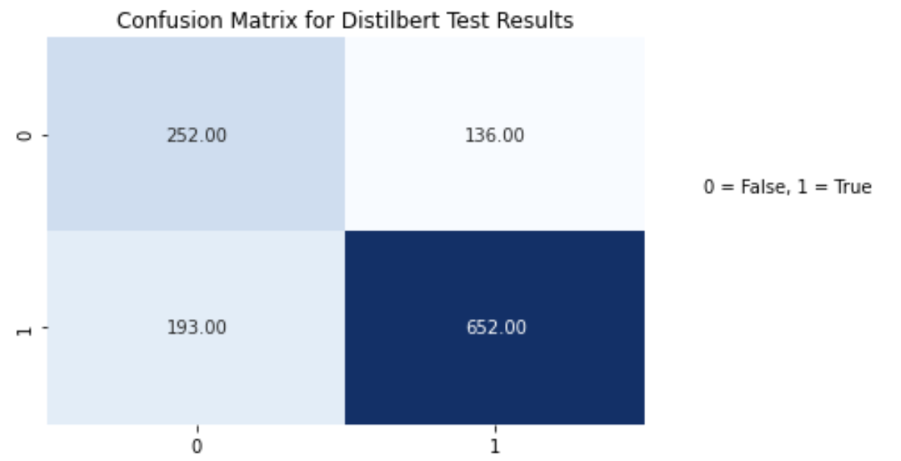

# Transfer Learning For Health Data Text Classification
by Brayton Hall

Table of Contents:

- [Data](#data)
- [EDA](#eda)
- [Distilbert for Binary Classification](#model)
- [Model Evaluation for Fine-tuned Distilbert](#results)

## Task
The task of this project was to weed out false public health claims from true claims using transfer learning with a pretrained transformer.

## Data from HuggingFace 
This dataset was obtained from the [health_fact](https://huggingface.co/datasets/health_fact) page on Hugging Face.
It includes claims, labels, sources, tags, evidence, and explanations for the veracity label. 
## EDA 
The following shows general info about the data. 
There are a total of 12, 288 claims in this dataset. Claims with no label ('-1') were dropped, and the the remaining claims were split into a training 
set (11,018 claims) and a test set (1,233 claims). The labels for these claims were [0,1,2,3], after dropping labelless claims, and correspond to 
'False, Mixture, True, Unproven'. For the sake of time, as well as computational limitations of this task, labels were converted in such a way to make this a 
binary classification problem, by assigning 'False' labels a 0, and all other claims (1,2,3) as 'True'. This resulted in some class imbalance:
### 
The imbalance is approximately .31:.69 :: False: True, meaning a baseline recall for catching False claims is about .31, if we guessed all claims were false. This could be addressed with downsampling or text augmentation, but neither were implemented in the training for this task. 

## Distilbert Model 
The [Distilbert model](https://huggingface.co/distilbert-base-uncased) was used as the transformer from Hugging Face for this task, mostly due to its being 
lightweight enough for fine-tuning given the computational constraints. The tokenizer used for preprocessing the claims were 
<code>DistilBertTokenizerFast.from_pretrained(MODEL_NAME)</code> from the <code>transformers</code> library. The training and test set were encoded with this tokenizer, and the training set (both claim and label) were converted into tensors to be used for fine tuning using <code>tensorflow</code> as follows:
 
 
<code>
   def construct_encodings(x, tkzr, max_len, trucation=True, padding=True):
    return tkzr(x, max_length=max_len, truncation=trucation, padding=padding)</code>
 
 
<code>
def construct_tfdataset(encodings, y=None):
    if y:
   
   
        return tf.data.Dataset.from_tensor_slices((dict(encodings),y))
   
    else:
   
   
        return tf.data.Dataset.from_tensor_slices(dict(encodings))
   
</code>
 

### Parameters and Training
- Max length of 120 (average claim length was around 120, thus 120 was set for truncation and padding to speed up training)
- Learning rate of 3e-5 with Adam optimizer
- 2 Epochs
- Batch size of 2
- The model took approximately two hours to train

## Results
After fine-tuning the transformer, the custom distilbert model was evaluated on the test set, with the following confusion matrix and scores:

### 

| Classification report : |           |        |          |         |
|-------------------------|-----------|--------|----------|---------|
|                         | precision | recall | f1-score | support |
| False (0)               | 0.57      | 0.65   | 0.61     | 388     |
| True (1)                | 0.83      | 0.77   | 0.80     | 845     |
| accuracy                |           |        | 0.73     | 1233    |
| macro avg               | 0.70      | 0.71   | 0.70     | 1233    |
| weighted avg            | 0.75      | 0.73   | 0.74     | 1233    |

The recall for False claims is .65, which is significantly better than .31, the baseline recall for 'dummy guessing' all claims as false. This score could mostly likely be improved with text augmentation to handle class imbalance, as well as incorporating more features in the text data for fine-tuning the Distilbert model. 

