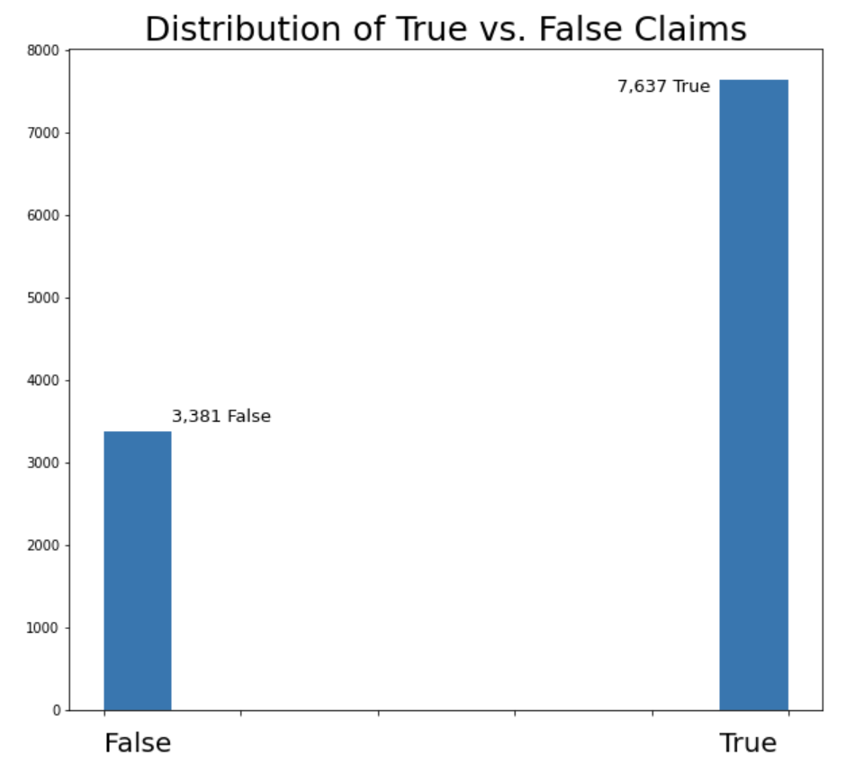

# Transfer Learning For Health Data Text Classification
by Brayton Hall

Table of Contents:

- [Data](#data)
- [EDA](#eda)
- [Distilbert for Binary Classification](#model)
- [Front End on Heroku](#results)

## Task
The task of this project was to weed out false public health claims from true claims using transfer learning with a pretrained transformer.

## Data from HuggingFace 
This dataset was obtained from the [health_fact](https://huggingface.co/datasets/health_fact) page on Hugging Face.
It includes claims, labels, sources, tags, evidence, and explanations for the veracity label. 
## EDA 
The following shows general info about the data. 
There are a total of 12, 288 claims in this dataset. Claims with no label ('-1') were dropped, and the the remaining claims were split into a training 
set (11,018 claims) and a test set (1,233 claims). The labels for these claims were [0,1,2,3], after dropping labelless claims, and correspond to 
'False, Mixture, True, Unproven'. For the sake of time, as well as computational limitations of this task, labels were converted in such a way to make this a 
binary classification problem, by assigning 'False' labels a 0, and all other claims (1,2,3) as 'True'. This resulted in some class imbalance:
### 

## Distilbert Model 

### Vectorizing 
Doc2Vec Parameters for Modelling:
- Vector size of 300 (each paragraph is represented as a vector with 300 dimension)
- Learning rate of .
- 2 Epochs
- Window size of 20 (for tokens, since word order in paragraphs matters) 

